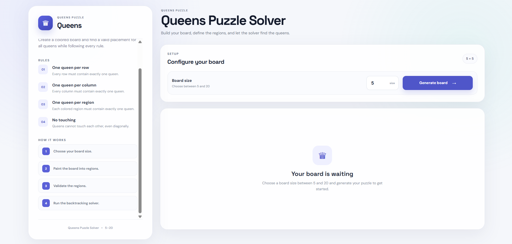
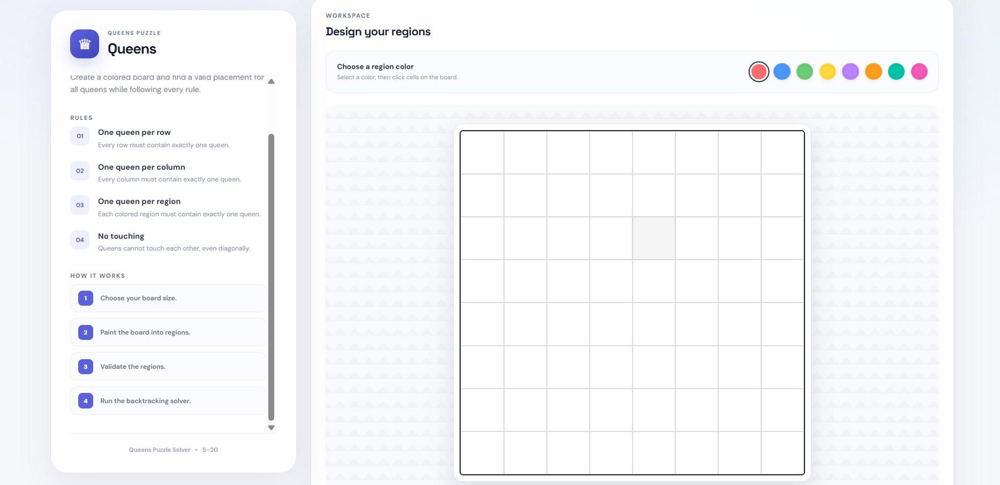
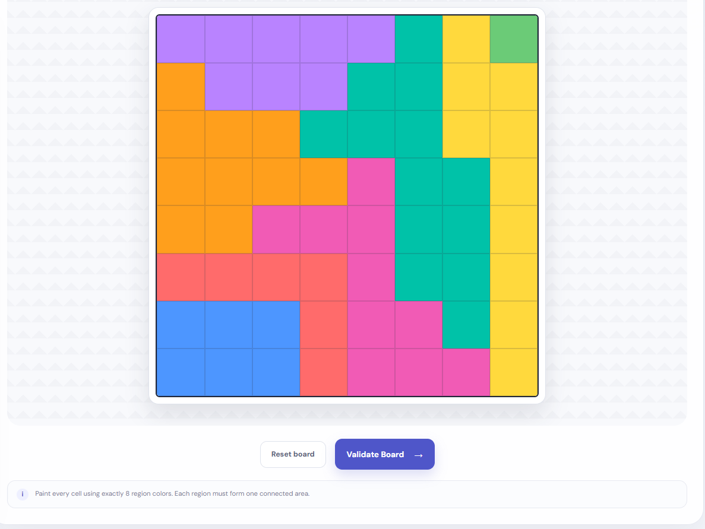
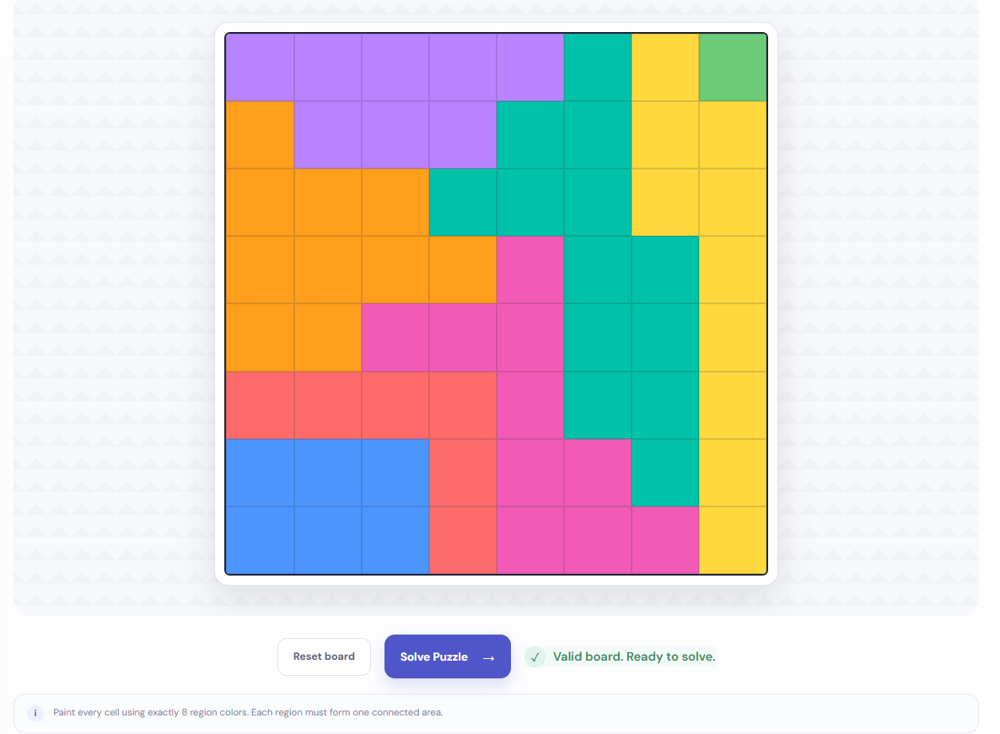
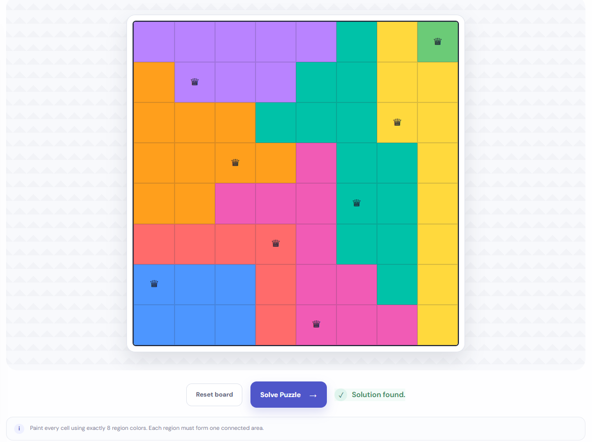
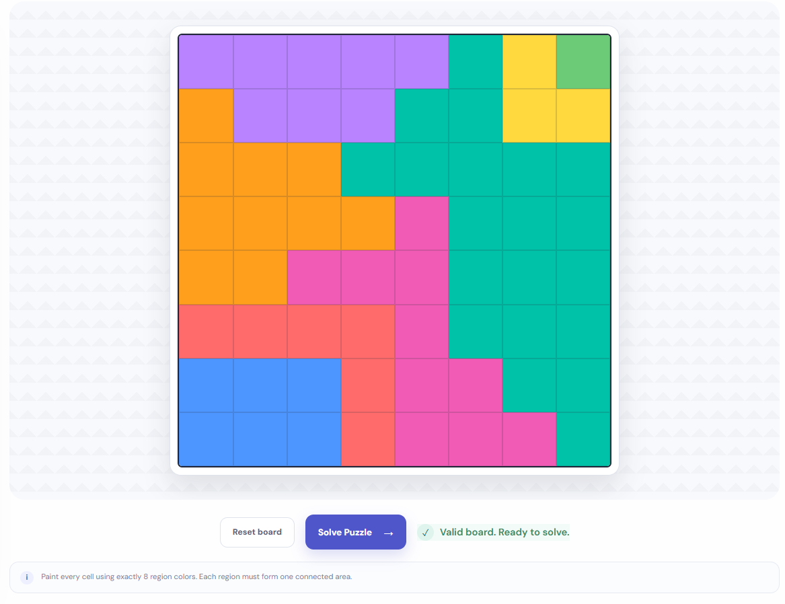
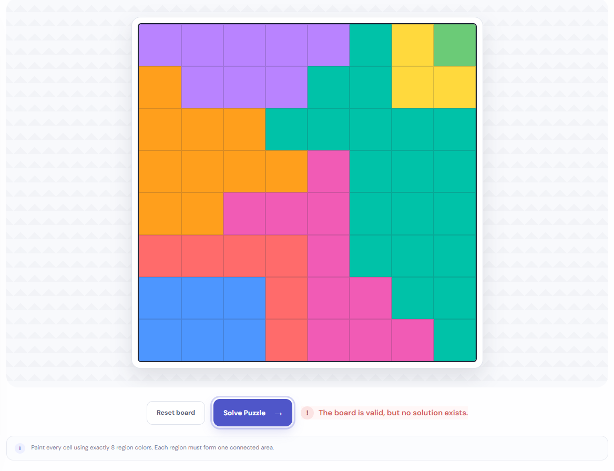

# Queens Puzzle Builder & Solver

A web-based Queens puzzle builder and solver inspired by the LinkedIn Queens puzzle.

Create your own custom puzzle by defining colored regions on an N × N board, validate the board structure, and solve the puzzle automatically using a backtracking algorithm.

## Features

- Custom board sizes from **5 × 5 to 20 × 20**
- Interactive grid-based board editor
- Create custom regions using colors
- Click-and-drag cell painting
- 20 predefined region colors
- Reset and edit boards easily
- Structural board validation
- Region connectivity validation
- Queens puzzle solver
- Backtracking-based solving algorithm
- Visual solution display
- Detection of unsolvable but structurally valid boards
- Responsive user interface

## How the Puzzle Works

For an N × N board:

- There must be exactly **N regions**
- Every cell must belong to a region
- Every region must be connected
- Regions use **4-directional connectivity** (up, down, left, right)
- Diagonal-only contact does not count as connectivity
- Exactly one queen must be placed in every row
- Exactly one queen must be placed in every column
- Exactly one queen must be placed in every region
- Queens cannot touch each other, including diagonally

Region sizes do not need to be equal. Regions can have arbitrary shapes as long as each region is connected.

## How to Use

### 1. Choose the Board Size

Enter a board size between **5 and 20** and generate the board.

### 2. Create the Regions

Select a color from the palette and paint cells on the board.

Each color represents one region.

Cells can be painted individually or by clicking and dragging across the board.

### 3. Validate the Board

After creating all regions, click **Validate Board**.

The application checks:

- Board dimensions
- Board size
- Empty cells
- Valid region IDs
- Number of unique regions
- Region connectivity

If the board is structurally valid, the application allows you to proceed to solving.

### 4. Solve the Puzzle

Click **Solve Puzzle**.

The solver attempts to place N queens while satisfying all puzzle constraints.

If a solution exists, the queens are displayed directly on the board.

If the board is structurally valid but no solution exists, the application reports that the puzzle is unsolvable.

## Validation

The application separates **board validation** from **puzzle solving**.

### Structural Validation

A board is structurally valid when:

1. The board size is an integer between 5 and 20.
2. The board is N × N.
3. Every cell has a region assigned.
4. Every region ID is valid.
5. Exactly N unique regions are present.
6. Every region is connected using four-directional adjacency.

### Solvability

A structurally valid board is not necessarily solvable.

After validation, the solver determines whether there is a valid placement of N queens satisfying the puzzle rules.

This separation makes it possible to distinguish between:

- **Invalid board** — the region structure itself is incorrect.
- **Valid but unsolvable board** — the region structure is correct, but no valid queen arrangement exists.

## Algorithm

The puzzle is solved using **backtracking**.

The solver processes the board row by row and attempts to place one queen in each row.

For every candidate cell, it checks:

- Whether the column already contains a queen
- Whether the region already contains a queen
- Whether the cell is adjacent to an existing queen

If the position is valid, the solver places the queen and recursively moves to the next row.

If the choice eventually leads to a dead end, the queen is removed and another position is tried.

### Simplified Algorithm

text
solve(row):

    if all rows are processed:
        return solution

    for every column in the current row:

        if column is already used:
            continue

        if region is already used:
            continue

        if cell is adjacent to an existing queen:
            continue

        place queen

        if solve(next row):
            return solution

        remove queen

    return no solution

# Board Validation Algorithm

Region connectivity is checked using Breadth-First Search (BFS).

For every region, the validator starts from one cell belonging to that region and explores its four neighboring cells.

If the number of visited cells is equal to the total number of cells belonging to that region, the region is connected.

Otherwise, the region contains disconnected sections and the board is rejected.

## Project Structure
src/
│
├── components/
│   ├── Board.jsx
│   └── ColorPalette.jsx
│
├── validators/
│   └── boardValidator.js
│
├── solver/
│   └── queensSolver.js
│
├── App.jsx
├── App.css
└── index.css

Board.jsx

Responsible for:

Rendering the board
Displaying region colors
Handling cell painting
Supporting click-and-drag interaction
Displaying queens after solving
ColorPalette.jsx

Responsible for:

Displaying the available region colors
Handling region color selection

App.jsx

Responsible for:

Managing application state
Generating boards
Resetting boards
Handling validation
Triggering the solver
Managing the solution
Controlling the overall application flow

boardValidator.js

Contains the structural validation logic for the custom board, including region connectivity checks.

queensSolver.js

Contains the backtracking algorithm responsible for finding a valid queen placement.

### Tech Stack
Technology	Purpose
React	User interface and application state
JavaScript	Application and algorithm logic
Vite	Development and build tooling
CSS	Styling and responsive design
Git	Version control
GitHub	Source code hosting

#### Getting Started
Prerequisites

Make sure you have Node.js and npm installed.

Clone the Repository
git clone https://github.com/prasannakarthiksurepalle-sudo/queens-solver
Navigate to the Project
cd queens-solver

#### Install Dependencies

npm install

Start the Development Server

npm run dev

Open the local development URL displayed in the terminal.

Build for Production

Create a production build:

npm run build

Preview the production build:

npm run preview

Application Workflow
Choose Board Size
        ↓
Generate Board
        ↓
Paint Regions
        ↓
Validate Board
        ↓
   ┌──────────────┐
   │ Valid Board? │
   └──────┬───────┘
          │
         Yes
          ↓
    Solve Puzzle
          ↓
   ┌─────────────────┐
   │ Solution Found? │
   └────────┬────────┘
            │
           Yes
            ↓
     Display Queens
Design Decisions
Region IDs Instead of Colors

The board internally stores region IDs rather than CSS color values.

For example:

[
  [0, 0, 1, 1],
  [0, 2, 2, 1],
  [0, 2, 3, 3]
]

The region ID represents the logical region, while CSS controls its visual appearance.

This keeps the puzzle logic independent from the UI styling.

Four-Directional Connectivity

A region is connected through:

        Up
         ↑
Left ← Cell → Right
         ↓
       Down

Diagonal cells are not considered connected.

Separate Validation and Solving

The validator answers:

Is this a properly constructed board?

The solver answers:

Can the queens be placed while satisfying all puzzle rules?

Keeping these responsibilities separate makes the code easier to understand, test, and maintain.

# Future Improvements
Automatic puzzle generation
Multiple solution detection
Step-by-step solving visualization
Solver animation
Difficulty estimation
Save and load custom puzzles
Puzzle sharing
Shareable puzzle URLs
Improved mobile interaction
Automated unit testing
Solver performance optimizations
Public deployment

## Learning Objectives

This project was built as a practical way to learn and apply:

React
Component-based architecture
State management
Interactive UI development
Grid-based data structures
Graph traversal
Breadth-First Search
Backtracking
Constraint satisfaction
Algorithmic problem solving
Separation of concerns
Git and GitHub

### Screenshots

